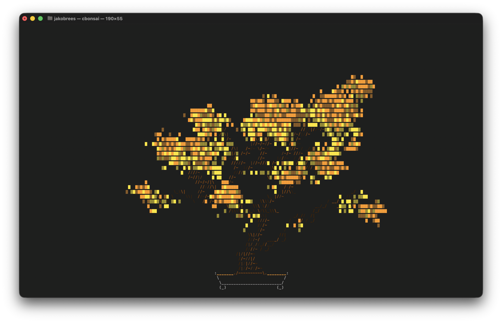
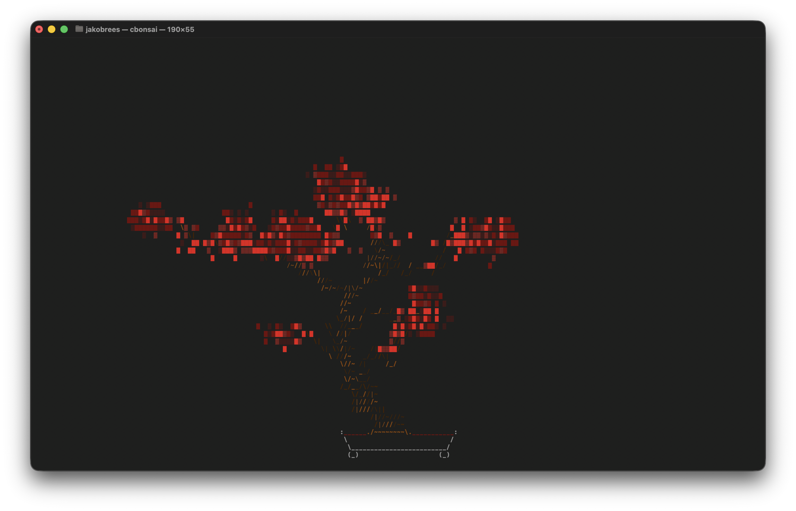
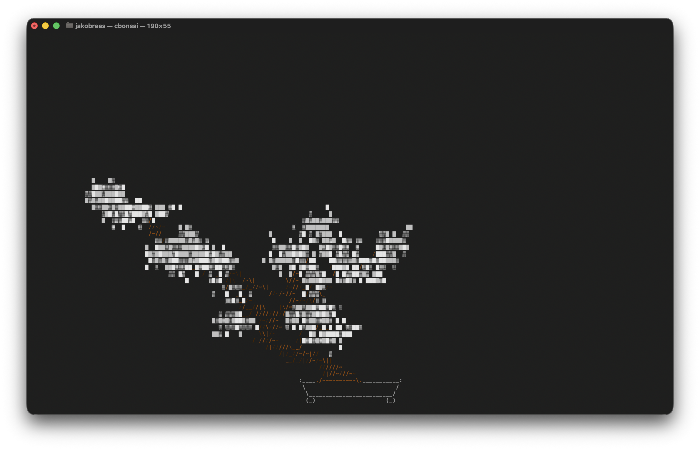
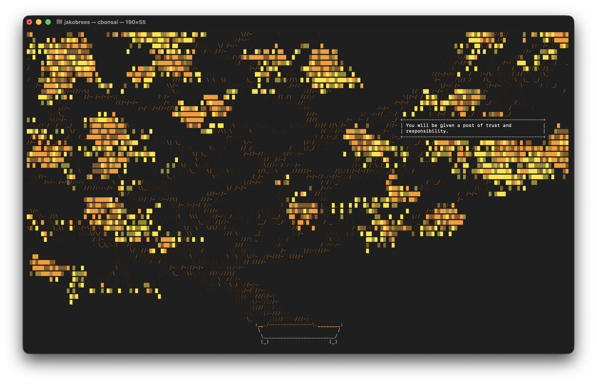
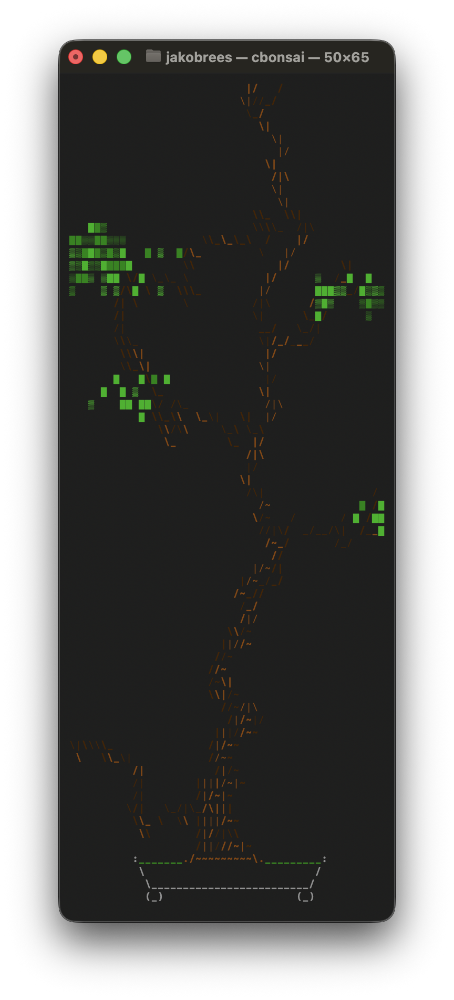

# cbonsai

cbonsai grows bonsai trees in your terminal — procedurally generated, colored by
season, and animated as they grow. Every tree is different: the engine grows a
trunk that wanders, leans, widens, and forks, then clothes it in procedural
foliage and the occasional patch of weathered deadwood.

<p align="center">
  <video src="https://github.com/jakobrees/cbonsai/raw/master/assets/bonsai-loop.mp4" autoplay loop muted playsinline controls width="80%"></video>
</p>

> 30 trees, grown live. this implementation of cbonsai began as a fork of
> [John Allbritten's cbonsai](https://gitlab.com/jallbrit/cbonsai); it has since
> diverged a long way downstream (a rewritten growth engine, procedural foliage,
> structural trunks, seasonal color, and persistent real-time growth).

## Gallery

Seasonal palettes — chosen automatically from the date, or forced with
`--season`:

<p align="center">
  
  
  
</p>
<p align="center"><sub>early fall&nbsp;·&nbsp;late fall&nbsp;·&nbsp;winter</sub></p>

A giant tree, with a message alongside it:

<p align="center">
  
</p>

## Features

- **Procedural foliage** — leaves grow as drifting walkers that pool into canopy
  pads rather than a symmetric blob (`-P`).
- **Structural branching** — the branch multiplier drives *bold structure*
  (leans, committed forks) instead of a radial explosion.
- **Trunk widening & taper** — trunks thicken at the base and taper as they
  climb, fork by fork.
- **Deadwood (jin/shari)** — limbs occasionally grow, then die back to bare,
  bleached wood.
- **Seasonal color** — spring greens through summer depth, autumn yellows and
  reds, winter whites; automatic by date or pinned with `--season`.
- **Live growth** — watch each step, at a speed you choose.
- **Named, persistent trees** — a tree can grow over days or weeks of real time,
  even while the program isn't running.
- **Messages** — display text beside the tree, with an optional timeout.
- **Save / load** — persist and resume tree state.
- **Versioned engines** — the growth algorithm is versioned; a saved tree always
  replays under the engine it was created with, so updates never reshape old
  trees.

## Installation

You'll need a working `ncursesw` / `ncurses` library.

### macOS (Homebrew)

```bash
brew install ncurses
git clone https://github.com/jakobrees/cbonsai.git
cd cbonsai
gcc -Wall -Wextra -Wshadow -Wpointer-arith -Wcast-qual -pedantic \
    -I$(brew --prefix)/opt/ncurses/include \
    -L$(brew --prefix)/opt/ncurses/lib \
    src/cbonsai.c src/msaw.c -o cbonsai \
    $(brew --prefix)/opt/ncurses/lib/libncurses.a \
    $(brew --prefix)/opt/ncurses/lib/libpanel.a
```

### Debian / Ubuntu

```bash
sudo apt install libncursesw5-dev
git clone https://github.com/jakobrees/cbonsai.git
cd cbonsai
make install PREFIX=~/.local
```

### Fedora

```bash
sudo dnf install ncurses-devel
git clone https://github.com/jakobrees/cbonsai.git
cd cbonsai
make install PREFIX=~/.local
```

## Usage

```
Usage: cbonsai [OPTION]...

Options:
  -l, --live             live mode: show each step of growth
  -t, --time=TIME        in live mode, wait TIME secs between
                           steps of growth (must be larger than 0) [default: 0.03]
  -P, --procedural       enable procedural leaf generation mode
  -i, --infinite         infinite mode: keep growing trees
  -w, --wait=TIME        in infinite mode, wait TIME between each tree
                           generation [default: 4.00]
  -S, --screensaver      screensaver mode; equivalent to -li and
                           quit on any keypress
  -m, --message=STR      attach message next to the tree
  -T, --msgtime=SECS     clear message after SECS seconds
  -b, --base=INT         ascii-art plant base to use, 0 is none
  -c, --leaf=LIST        list of comma-delimited strings randomly chosen
                           for leaves
  -M, --multiplier=INT   branch multiplier; higher -> more
                           branching (1-20) [default: 10]
  -N, --name=TIME        create a named tree that grows over real time,
                           where TIME is life of tree in seconds.
                           MUST be used with -W to specify a save file.
                           (automatically enables -l and -P)
  -L, --life=INT         life; higher -> more growth (10-500) [default: 60]
  -p, --print            print tree to terminal when finished
  -s, --seed=INT         seed random number generator
      --engine=INT       tree generation engine version for new trees
                           (1 or 2) [default: 2]; loaded trees use
                           their saved version
      --bare             suppress foliage; draw only the woody structure
                           (v2 engine only; same tree, leaves hidden)
      --season=NAME      force seasonal colors instead of using the date:
                           spring, summer, autumn, late-autumn, winter
  -W, --save=FILE        save progress to file [default: ~/.cache/cbonsai]
  -C, --load=FILE        load progress from file [default: ~/.cache/cbonsai]
  -v, --verbose          increase output verbosity
  -h, --help             show help
```

## Examples

```bash
# A simple tree
cbonsai

# Watch one grow, live
cbonsai -l

# A big, tall tree (low multiplier grows tall and slender)
cbonsai -l -L 200 -M 4

# Pin the season regardless of the date
cbonsai --season winter

# A tree with a message beside it, cleared after 10s
cbonsai -m "Happy Birthday!" -T 10
```

### Named trees (real-time growth)

A named tree keeps growing in real time, even when cbonsai isn't running — it
records when it was created and advances to the present each time you load it.

```bash
# Create a tree that grows over 30 days (2,592,000 seconds)
cbonsai -N 2592000 -W ~/my_tree

# Load it later and let it catch up to now
cbonsai -C ~/my_tree
```

### Screensaver

```bash
# Saves/loads automatically; quits on any keypress
cbonsai -S
```

### A bonsai in every terminal

```bash
echo "cbonsai -p" >> ~/.bashrc
```

## How it works



The trunk and branches are grown by an iterative simulation: each branch is a
walker with its own life, age, and lean that wanders, rises, sprouts shoots, and
occasionally forks, while procedural walkers grow the foliage on top. Randomness
comes from deterministic per-stream generators, so a given seed always produces
the same tree — and cosmetic-only streams are kept separate from the growth
stream so visual tweaks never reshape a saved tree.

The growth algorithm is **versioned**. New trees use the latest engine (v2);
trees loaded from a save file replay under whatever engine they were created
with, so algorithm updates never change the look of an existing tree. Pass
`--engine` to choose the engine for new trees.

## Credits

cbonsai is a fork of [`cbonsai` by John Allbritten](https://gitlab.com/jallbrit/cbonsai),
which was itself inspired by earlier terminal bonsai generators. Thanks to John and 
those prior authors for the original idea and foundation.

## License

GNU General Public License. See [LICENSE](LICENSE).
